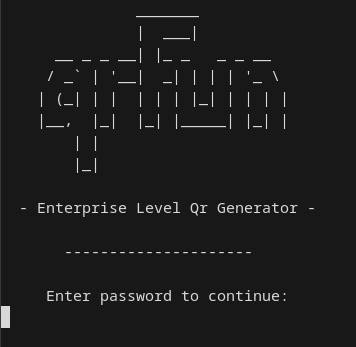

# QrFun

### Challenge Summary
In this challenge we are given an **unstripped** 64-bit executable that simulates an internal QR generation tool used by a companie's employees to generate qr code's that redirect to certain websites and  are stored in the company's QR indexing server.

#### Solving Steps
When executing the binary we can observer the fact that it is password locked:\
\
We can see that for us to use a the tool, we need to input the password.

The easiest solution to the problem is to use `GDB` to jump to the function that is responsible for generating the QrCode, for that we need to:

- Open the `app` file in `GDB`
- `info functions` to list all the functions
- `break main`
- `jump generate_code`
- proceed in entering the website name to generate the code for: `www.cybertm.ro`
- scan the generated qr code 
- use burp proxy to access to website in the Qr 
- catch the response with the flag visible before the redirect

##### Alternative solution:
We could use a RE tool like [Ghidra]('https://ghidra-sre.org/') to skip the password validation phase, patching the password equality comparison with `NOP` instructions, which basically mean: **No operation**, proceeding to jump to the **generate_code()** function.
