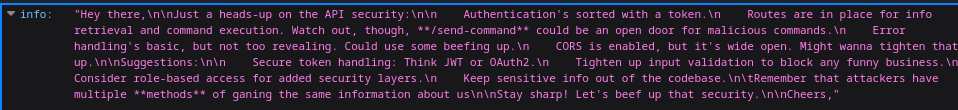

# QrFun

### Challenge Summary
In this challenge we are given an **unstripped** 64-bit executable that simulates an internal QR generation tool used by a companie's employees to generate qr code's that redirect to certain websites and  are stored in the company's QR indexing server.

#### Solving Steps
When executing the binary we can observer the fact that it is password locked:\
\
We can see that for us to use a the tool, we need to input the password.

The easiest solution to the problem is to use `GDB` to jump to the function that is responsible for generating the QrCode, for that we need to:

- Open the `app` file in `GDB`
- `info functions` to list all the functions
- `break main`
- `jump generate_code`
- proceed in entering the website name to generate the code for: `www.cybertm.ro`
- scan the generated qr code 
- use burp proxy to access to website in the Qr 
- catch the response with the flag visible before the redirect

##### Alternative solution:
We could use a RE tool like [Ghidra]('https://ghidra-sre.org/') to skip the password validation phase, patching the password equality comparison with `NOP` instructions, which basically mean: **No operation**, proceeding to jump to the **generate_code()** function.

# GerSam

### Challenge Summary

In this challenge we are presented the website of the car retailer GerSam, where we need to find the flag.\

 

#### Solving Steps
- Looking in the footer, we can find a **Youtube Link** that goes to the old Toyota Corolla (*legendary-meme-status*) commercial. \
- We can deduce from here since it's a car selling website and there is a great emphasis on the Toyota Corolla model, not only in the footer, but in the info section as well that it might have something to do with this specific car model. \
- We navigate to the cars page and see a lot of car cards show up. We scroll down to the Toyota Corolla model and click the button to view it. \
On the car's page we can see a bunch of details about the car but not quite the flag.
- We see some button's that say when *clicked* that their functionality has not been implemented yet... but maybe that is the case just on the frontend and data is still sent for their later usage
- In the network section we can see that this page does an **API** request to get the data about the model so we decide to investigate this in **Burp** to see if it's not leaking any data.
- Once opened in burp, we can see that the **API** is sending more json data then needed for the page rendering, such as details for the buttons that are not working and the **flag** :)

# SysAdmin 

### Challenge Summary

In this challenge we are given a **GET** endpoint to an **API** that sounds like it is used for the SysAdmin of a certain company to remotely manage their systems. \

 

#### Solving Steps

- We can conclude this is a **JSON** api since when fetching / we get some json response back.
- We can observe the fact that in the json data send to us it mentions the fact that the  `send-command` endpoint is an open door to malicious commands and the fact that CORS is not strict.
- We do a `POST` request on the `send-command` endpoint with the body consisting of the `command` key with the value being the command we want to execute (for example `whoami`) but we see that we are not allowed to do that if we don't provide some sort of authentication since it prompts us with `Unauthorized`
- We see in the first response on `GET` / that: 
> the attackers have **multiple** methods of gaining the same information
- This statement is hinting us that maybe another `HTTP` request method might not be handled securely.
We try a `PUT` request wit the payload:
```bash
curl -X PUT http://127.0.0.1:5000/send-command \
-H "Content-Type: application/json" \
-d '{"command":"ls"}'
```
- We get the response:
```bash
{"output":"api.py\nflag.jpg\ninfo.txt"}
```
- We know that there is an image called `flag.jpg` so maybe our flag is there and perhaps this is some sort of *remote-stegano* challenge.
- We send the payload:
```bash
curl -X PUT http://127.0.0.1:5000/send-command
-H "Content-Type: application/json" 
-d '{"command":"exiftool flag.jpg | grep CYBERTM"}'
```
- And we get our flag :)

